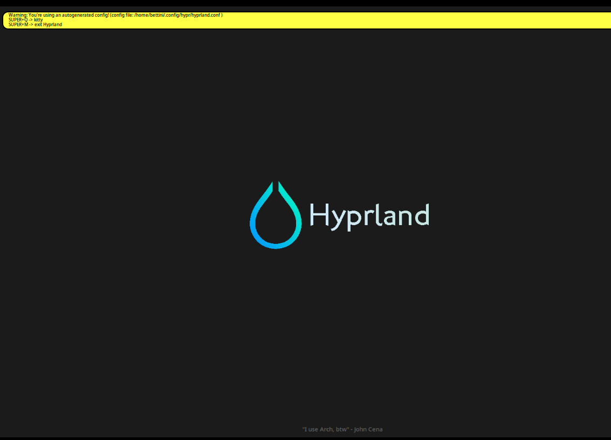
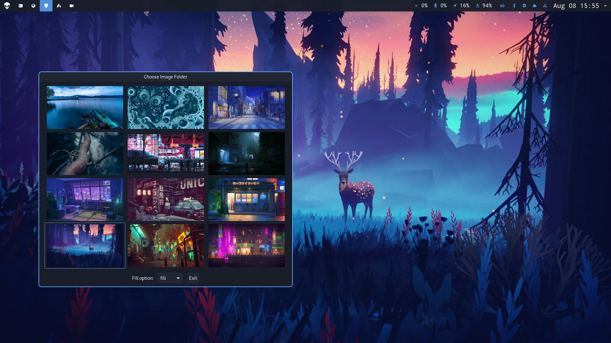
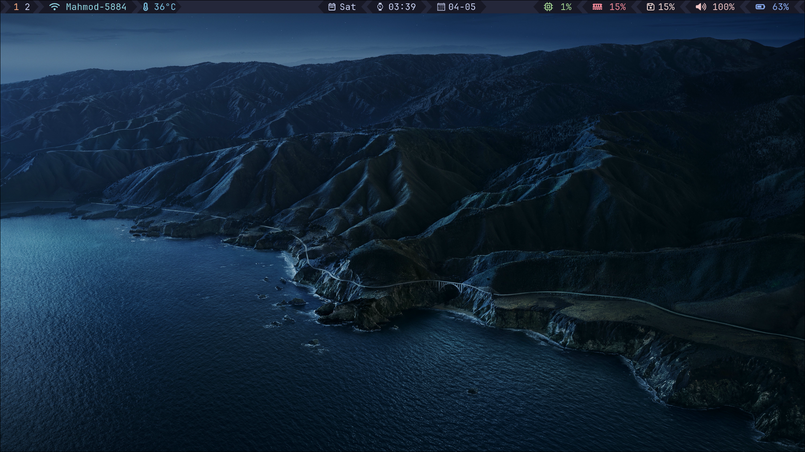
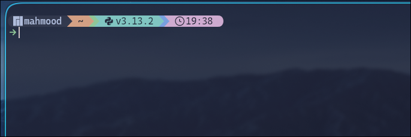
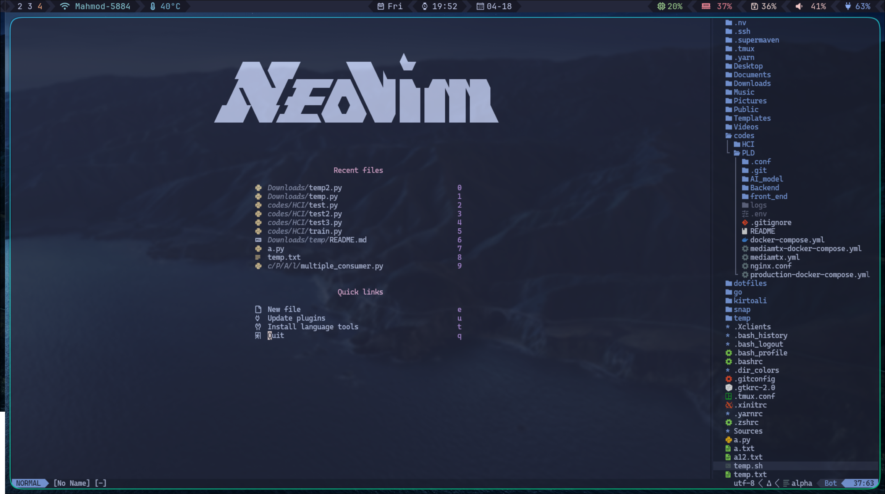

# Dotfiles

This is my personal dotfiles repository. It contains my configuration files for various applications and utilities. i am using manjaro linux so i am not sure if it will work on other distros or not. i will update this readme as i add more files.and try to make it more readable.

I might add an install script for my dotfiles in the future. but for now, i will just keep it as a readme file. so before we start clone this repo to your home directory.

```bash
git clone https://github.com/mr-mahmood/dotfiles.git
```

now lets start, shall we?

## apps

This are the apps i am using and i have added a part for config and install it. so click on every one of them that you like but i suggest you to follow the way that i add.

- [hyperland](#hyperland)
- [fish](#fish)
- [starship](#starship)
- [nvim](#nvim)
- [tmux](#tmux)
- [waybar](#waybar)
- [waypaper](#waypaper)
- [wofi](#wofi)

# hyperland

This is my personal configuration for hyperland. i am using it for my daily work. and it is amazing as i personalize it for my self, for install it first we need to install **[hyprland](https://hyprland.org/)** it self and **[kitty](https://github.com/kovidgoyal/kitty)** because hyprland use kitty as it`s default terminal

1. install kitty and hyprland and stow

```bash
sudo pacman -S kitty hyprland stow fish starship
```

2. after installing completed, log out of your gnome session or KDE session and log in to hyprland.

3. Now you are in hyprland and you see a screen like this:


don't panic, it's just just original first run hyprland screen.

4. now we need to install our configurations for hyprland, so we will use stow to install it.

```bash
cd ~/dotfiles
stow hyprland
```


> [!WARNING]  
> if you have any problem with stow, delete hypr directory in .config directory and try again.

5. hyprland config has multiple parts, so we need to install them one by one.
```bash
sudo pacman -S waybar hyprlock hyprpaper swww wofi
yay -S waypaper hyprshot swaync
```

> [!WARNING]  
> [yay](https://github.com/Jguer/yay) can be install using pacman, and if you find any problem using yay,
you can let me know in the issues section.
>
> using hyperland and other apps need some custome nerdfonts, so you need to install them. i provide fonts in my dotfiles use them


- [waybar](https://github.com/Alexays/Waybar) is a status bar for hyprland like this:


- [hyprlock](https://github.com/hyprwm/hyprlock) is a lock screen for hyprland, this is a example that i change it in my own prefer


- [hyprpaper](https://wiki.hyprland.org/Hypr-Ecosystem/hyprpaper/) is the official wallpaper utility for Hyprlands a wallpaper 
- [swww](https://github.com/LGFae/swww) is a window switcher that allow you to change wallpapers with cool animations.


- [wofi](https://github.com/SimplyCEO/wofi) is a application launcher for wayland, it is a replacement for rofi.
- [waypaper](https://github.com/anufrievroman/waypaper) is a wallpaper GUI for hyprland and can be use to set your wallpapers.



- [hyprshot](https://github.com/Gustash/Hyprshot) is a screenshot utility for hyprland
- [swaync](https://github.com/ErikReider/SwayNotificationCenter) is a notification daemon for hyprland

6. now lets add our wallpapers to hyprland, so we will use waypaper and hyprpaper to do that. but first lets add it to config directory and rest of it is automatic:
```bash
cd ~/dotfiles
stow backgrounds
```

so now we have installed all depentences and add configs for hyprland, now lets use it. and learn what we can do with it, if you installed hyprland and add configs to it, you should see something like this after a reboot:



it is beatiful, isn't it? now lets find out what we can do with it.

> [!NOTE]
>
> Hyperland is a tiling window manager, therefore we can use keyboard without need of a mouse
and this will improve our productivity. by the way it's fun to use it so that's a very good thing.

once we are in hyprland, we can use some keybindings to open some apps, so lets see what we can do with this keybindings:

---
> [!TIP]
>
> super is window key by default and you can change it in config file

open and close windows:
- super + space : launch wofi
- super + q : open terminal(kitty, fish, etc)
- super + e : open file Manager
- super + f : open firefox
- super + c : close active window
---
exit and lock hyprland:
- super + m : exit hyprland
- super + ctrl + l : lock screen
---
wallpaper:
- super + t : cahnge wallpaper
- super + shift + t : launch waypaper
---
screenshot:
- print : take screenshot of a region
- shift + print : take screenshot of the whole screen
---
move windows and focus:
- super + Shift + h : move window to the left
- super + Shift + j : move window to the bottom
- super + Shift + k : move window to the top
- super + Shift + l : move window to the right
- super + h : move window focus to the left
- super + j : move window focus to the bottom
- super + k : move window focus to the top
- super + l : move window focus to the right
---

there is a lot more about hyprland and i leave it to you to explore it.

# fish
[fish](https://fishshell.com/) is a shell that is similar to bash, but with a lot of features. i am using it for my daily work and i have added a part for config and install it. main resone for me to use it is its auto completion which is amazing

we install it using pacman before so we will config it in the fish config file.
```bash
cd ~/dotfiles
stow fish
```
now when we open terminal it use fish and starship as it`s prompt.which make it look like this:



# starship
[starship](https://starship.rs/) is a prompt for zsh, bash, fish, powershell, and xonsh. it is a very useful tool for developers and it`s a must have for any developer. i am using it in daily work and it make my terminal look clean and well structured so i will recemond you to use it as well, we already install it before and it is in fish config file, you can use it or delete it.

# nvim
[nvim](https://neovim.io/) is a text editor, a modern, blazing fast, persistent text editor that's easy to extend with Lua. it is a fork of vim it self and it has a lot of features and it is very powerful and i am using it for my daily work. i have a lot of plugins for it which make it very easy and straightforward to use, i add them here and you only need to open nvim once and it will install them automatically.

but first lets install it:
```bash
sudo pacman -S neovim
cd ~/dotfiles
stow nvim
```

after you install plugins you should close and reopen it and you will see something like this:



now lets see what plugins i am using and what they do:

1. [catppuccin](https://github.com/catppuccin/nvim)
    - it is a theme for nvim, it is very beautiful and i am using it for my daily work.
2. [cmd-completion](https://github.com/hrsh7th/cmp-cmdline)
    - it is a plugin for nvim which provides autocompletion for commands.
3. [comment](https://github.com/tpope/vim-commentary)
    - it is a plugin for nvim which provides commenting functionality.
4. [dashboard](https://github.com/goolord/alpha-nvim)
    - it is a dashboard for nvim, which make home screen for nvim look beautiful.
5. [eyeliner](https://github.com/jinh0/eyeliner.nvim)
    - it is a plugin for nvim which provides an easy way to find words in a line.
6. [indent-blankline](https://github.com/lukas-reineke/indent-blankline.nvim)
    - it is a plugin for nvim which provides a visual indicator for indentation levels.
7. [leap](https://github.com/ggandor/leap.nvim)
    - it is a plugin for nvim which provides a cool way to find words in a file.
8. [lualine](https://github.com/nvim-lualine/lualine.nvim)
    - it is a plugin for nvim which provides a status bar for nvim.
9. [markdown-preview](https://github.com/iamcco/markdown-preview.nvim)
    - it is a plugin for nvim which provides a markdown preview.
10. [minilogo](https://github.com/echasnovski/mini.nvim)
    - it is a plugin for nvim which provides a logo for files in nvim.
11. [neo-tree](https://github.com/nvim-neo-tree/neo-tree.nvim)
    - it is a plugin for nvim which provides a file explorer.
12. [noice](https://github.com/folke/noice.nvim)
    - it is a plugin for nvim which provides a notification system.
13. [none-ls](https://github.com/nvimtools/none-ls.nvim)
    - it is a plugin for nvim which provides a language server.
14. [oil](https://github.com/stevearc/oil.nvim)
    - it is a plugin for nvim which provides a file explorer.
15. [render-markdown](https://github.com/MeanderingProgrammer/render-markdown.nvim)
    - it is a plugin for nvim which provides a markdown preview.
16. [snack](https://github.com/folke/snack.nvim)
    - it is a plugin for nvim which you can use some custome plugins with in it like lazygit
17. [supermaven](https://github.com/supermaven-inc/supermaven-nvim)
    - it is a plugin for nvim which is like copilot for nvim. but it is faster than copilot for me
18. [surround](https://github.com/kylechui/nvim-surround)
    - it is a plugin for nvim which provides a way to surround text with a character.
19. [telescope](https://github.com/nvim-telescope/telescope.nvim)
    - it is a plugin for nvim which provides a fuzzy finder.
20. [tmux-navigator](https://github.com/christoomey/vim-tmux-navigator)
    - it is a plugin for nvim which provides a way to navigate between tmux panes within nvim.
21. [treesitter](https://github.com/nvim-treesitter/nvim-treesitter)
    - it is a plugin for nvim which provides a syntax highlighting for programming languages.
22. [typro](https://github.com/nvzone/typr)
    - it is a plugin for nvim which provides a typing training in nvim.
23. [undotree](https://github.com/mbbill/undotree)
    - it is a plugin for nvim which provides a tree view for undo history.
24. [vague](https://github.com/vague2k/vague.nvim)
    - it is a dark theme for nvim.

thats all i use and if i find any new plugin i will add it here.
some of them need extra work to run correctly, but i will leave it to you to do it.

